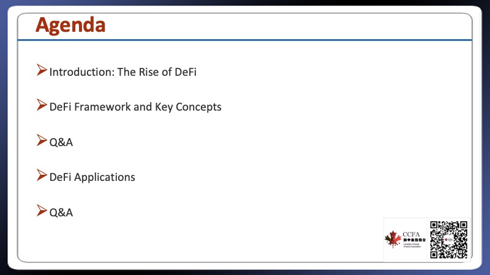
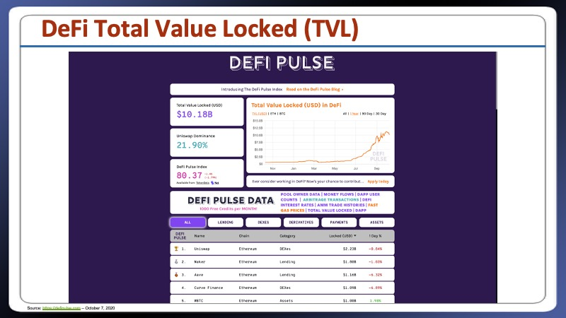
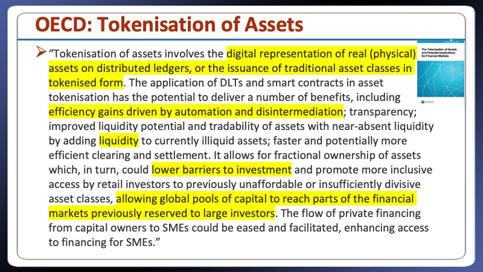
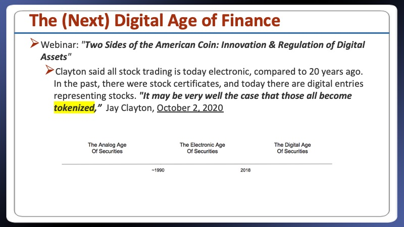
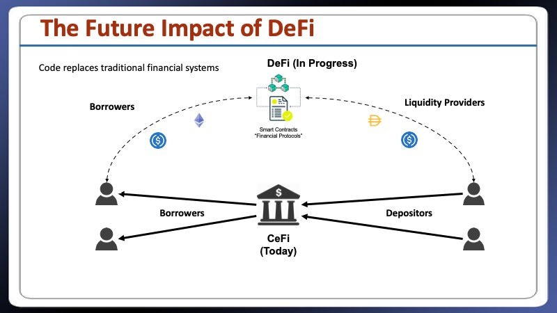
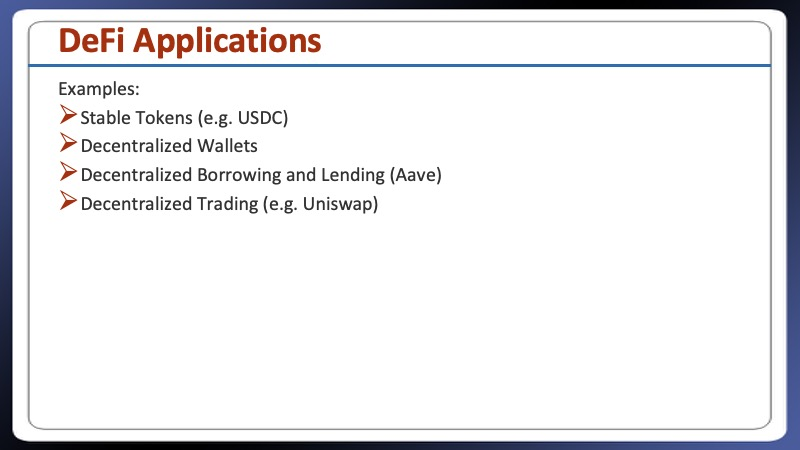
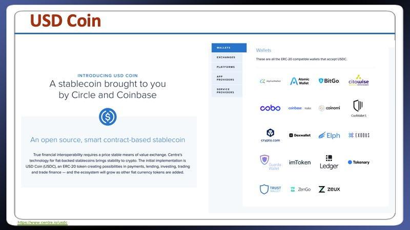
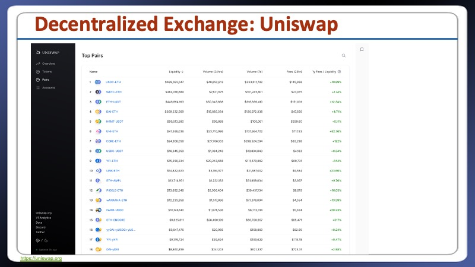
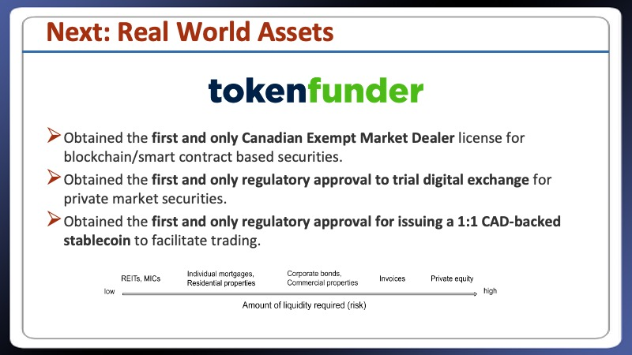

# The Rise of Decentralized Finance
### CCFA Webinar : October 7, 2020 
### Presented by : Alan Wunsche

[Download Slides - To be available after Webinar](./CCFA-Seminar-DecentralizedFinance-AlanWunsche-October7,2020.pptx)

- - - - -

# Agenda

1. Introduction: The Rise of DeFi

2. DeFi Framework and Key Concepts

3. DeFi Applications

# 1. Introduction: The Rise of DeFI

https://pomp.substack.com/p/the-sec-chairman-sees-a-tokenized

    

- - - - -

# 2. DeFi Framework and Key Concepts

    

- - - - -

# 3. DeFi Applications

## Stable Tokens

https://www.coinbase.com/usdc

https://www.centre.io/usdc

## Abra

# Uniswap

https://uniswap.org
[Uniswap Monthly Volume Surpasses Coinbase Under the Influence of the DeFi Craze](https://blockchain.news/news/uniswap-monthly-volume-coinbase-under-influence-defi-craze)

https://blockchain.news/analysis/iso-20022-payments-revolution-central-banks-strike-back-against-bitcoin-defi-xrp-will-boom

https://app.uniswap.org/#/swap

# Aave

https://aave.com/

https://aave.com

## TokenFunder

https://tokenfunder.com

    

- - - - -

[ISO 20022—Central Banks Strike Back Against Bitcoin and DeFi Payments But XRP Price Will Surge](https://blockchain.news/analysis/iso-20022-payments-revolution-central-banks-strike-back-against-bitcoin-defi-xrp-will-boom)

